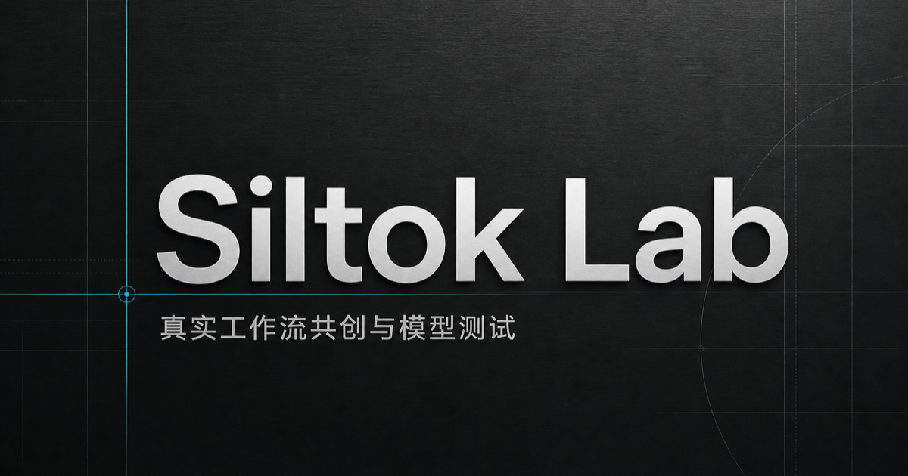

# Siltok Lab

面向 Siltok 首批深度用户的工作流共创、真实测评与问题闭环平台。当前版本是一条可操作的 MVP 纵向链路：用户可以创建真实项目、提交工作流和痛点、上传证据附件，并由团队更新问题状态。



## 前端展示版

这个仓库可以直接作为产品演示使用。首页、手机号登录、共创项目、工作流、Skill 模板、AI 视频经验库、负面反馈与运营后台均已包含演示状态；本地启动不需要真实短信或生产数据库凭证。服务端接口与数据结构作为后续产品化参考保留，所有生产密钥均通过环境变量注入，不进入仓库。

主要页面：`/`、`/login`、`/projects`、`/workflows`、`/templates`、`/experience`、`/issues`、`/admin`。

## 产品范围

- 首页：以真实商业任务为入口，展示共创项目、工作流证据、失败反馈与 Lite / Pro 双 SKU。
- 项目库：沉淀业务目标、内容类型、交付标准与保密等级。
- 工作流库：记录模型、硬件、参数和当前验证状态。
- Skill 与模板库：官方提供任务拆解 Skill 和可运行工作流模板，标注适用模型、硬件边界与验证等级；用户可保存到个人工作台。
- 问题池：保存严重程度、复现状态、影响范围和处理状态。
- 附件：JSON、工作流压缩包、截图、视频和音频写入对象存储。
- 登录：手机号验证码是第一阶段主入口；微信开放平台网站应用 OAuth 保留为后续快捷入口。未配置真实凭证时不会伪造短信或二维码。
- 经验库：把公开教程和测评整理为署名摘要，保留原平台与原链接；不把原作者冒充为社区用户。
- 运营后台：`/admin` 查看注册、登录事件、项目、工作流、问题和上传文件。检索键保存为不可逆哈希，运营联系方式单独加密保存。

## 技术结构

- 前端与服务端：Vinext / React 19
- 关系数据：Cloudflare D1 + Drizzle migrations
- 文件存储：Cloudflare R2
- 校验：Zod
- 部署：OpenAI Sites

数据表包括用户、手机验证码、登录事件、项目、工作流、工作流版本、运行记录、Skill/工作流模板、公开经验、模板保存记录、问题、评论、附件和同意记录。接口位于 `app/api`，页面与数据库查询共享 `lib/records.ts`。

## 本地运行

```bash
npm install
npm run dev
```

本地开发服务首次访问时会创建表并注入一组演示记录。生产发布通过 `drizzle/` 中的迁移建立结构。

## 手机验证码接入（第一阶段）

在腾讯云短信控制台开通国内短信，完成签名与验证码模板审核，然后配置：

- `TENCENT_SECRET_ID` / `TENCENT_SECRET_KEY`：CAM API 密钥；
- `TENCENT_SMS_SDK_APP_ID`：短信应用 SDK AppID；
- `TENCENT_SMS_SIGN_NAME`：已审核签名内容，不带方括号；
- `TENCENT_SMS_TEMPLATE_ID`：已审核模板 ID；
- `TENCENT_SMS_TEMPLATE_CODE_ONLY`：模板只有一个验证码变量时设为 `true`，含验证码与有效分钟数两个变量时保持 `false`；
- `AUTH_HASH_SECRET`：高强度随机密钥，用于验证码、手机号和会话签名；
- `CONTACT_ENCRYPTION_SECRET`：建议单独设置，用于加密后台可查看的手机号；
- `SILTOK_ADMIN_PHONE`：运营管理员手机号，成功登录后获得 `/admin` 权限。

验证码 5 分钟有效，同一手机号 60 秒内不能重复发送；数据库不保存验证码或手机号明文，运营联系方式使用 AES-GCM 加密后保存。

## 微信快捷登录（第二阶段）

微信登录需要微信开放平台的“网站应用”，不是公众号网页授权。当前代码已实现 OAuth state 校验、授权码交换、用户资料读取、D1 用户写入和签名会话 Cookie。上线还需要：

1. 微信开放平台网站应用审核通过；
2. 把 `WECHAT_WEB_REDIRECT_URI` 配置为 `https://你的域名/api/auth/wechat/callback`，并在开放平台登记相同回调域名；
3. 为 `AUTH_HASH_SECRET` 设置一段不可公开的高强度随机值；
4. 将站点从仅自己可见切换为获批的外部访问范围；
5. 补充隐私政策、用户协议、账号绑定和数据删除流程。

预览版本不会伪造短信或微信登录，也不会把密钥写入仓库。
